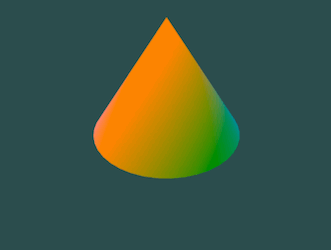

# Cone-Triangulation-Model
Cone Triangulation Model implemented in OpenGL using Xcode.
This project demonstrates the creation and rendering of a 3D cone, triangulated into smaller polygons for visualization. Utilizing modern OpenGL libraries, the program implements basic lighting, smooth shading, and real-time rotation to simulate realistic surface effects. Designed to run in Xcode with adjustable parameters for experimentation and learning.

***Library setup instructions for creating new project can be found [here](https://github.com/ESBehtev/FlatShapeModel).***
